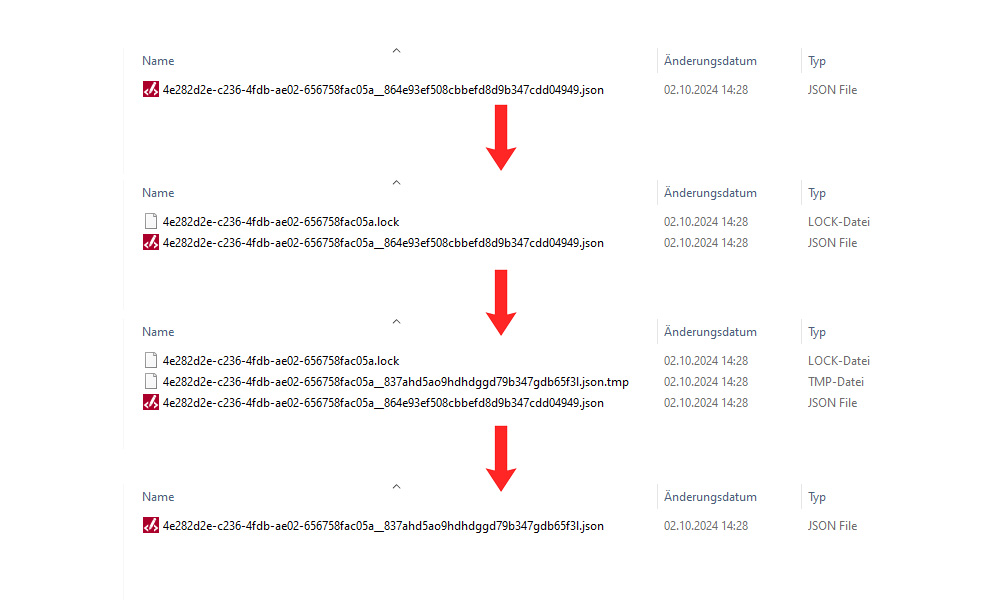

Technical Background
====================

Collision avoidance for parallel accesses
-------------------------------------------

As mentioned at the beginning, NofearDB was developed with the idea that parallel accesses and write operations can take place on the database. This section explains how these parallel accesses are handled by NofearDB. This should help to understand any problems that may occur and to be able to assess the risks when using NofearDB.

Competition is taken into account at various points in the implementation. First and foremost is the design decision to save each document as a separate JSON file. This decision comes at the expense of performance, as it results in more file system accesses than is usual with other DBMSs. However, the problem of concurrency is also kept to a minimum from the outset, as the only way concurrency can occur at all is if one and the same document is changed at the same time. Therefore, only those documents that are affected by an operation must be protected against parallel editing. This is a great advantage over other embedded DB systems such as SQLite, where a write access leads to a lock of the entire database.

Nevertheless, the requirement remains that a document must not be edited in parallel in order to keep the database consistent. To ensure this, all documents that are potentially affected by an operation are locked before the operation even takes place. This also affects all documents that are directly or indirectly related to the document to be written, as the relationships may have to be updated here. The locks are first physically written to the database and only allow changes to be made by the user who created the locks. If a document has already been locked by someone else, the entire operation fails and all locks already set are removed. The operation is only executed once all documents have been successfully locked. This ensures that no one can make changes to a document at the same time. After the operation, all locks are removed again. If a system error occurs, all locks are timed out by default so that no deadlocks occur if locks are not removed correctly.

The actual writing of data is a critical moment, as a system crash can lead to inconsistent data. In addition, the entire database is in an inconsistent state for a brief moment, which can lead to phantom reads. NofearDB tries to keep this moment as short as possible and guarantees consistent data at least per document. To do this, all data is first written to a temporary file that is not read by read operations. Only when all data from all documents has been written are the existing documents replaced by the temporary ones. In this way, invalid data is recognized before it is persisted and the risks of write and system errors are minimized. The following graphic shows the write process with all artifacts once again in the file system:

.. note::

    Please note that a system error can also occur during the replacement process, which can lead to inconsistencies between documents, since some are updated and some are not. To avoid this and to be able to recover a valid state the implementation of a Write-Ahead-Log (WAL) is planned, but not yet realized.

Caching
-------

Reading and writing on a file system is a very slow operation. However, reading from a database should ideally be very fast. For this reason, a caching mechanism was built into the engine. The engine stores data once it has been read in RAM. When reading documents, only those document files that have changed are opened and read in again. This prevents a large number of read accesses to the file system. 
To quickly recognize which documents have changed, NofearDB uses the property that reading file names in a directory is much faster than opening and reading a file. For this reason, not only the ID but also a hash value is stored in the file name for each document, which represents the stored data. In this way, it can be deduced from the file name whether a document has been changed or not.

.. note::

    Please note that the cache must first be warmed up, which usually happens during the first query operation. This can take a very long time. However, all further read operations are then much faster. It is advisable to warm up the cache at the start of the program, especially with large amounts of data, so that users do not notice any delay at a later point in time.